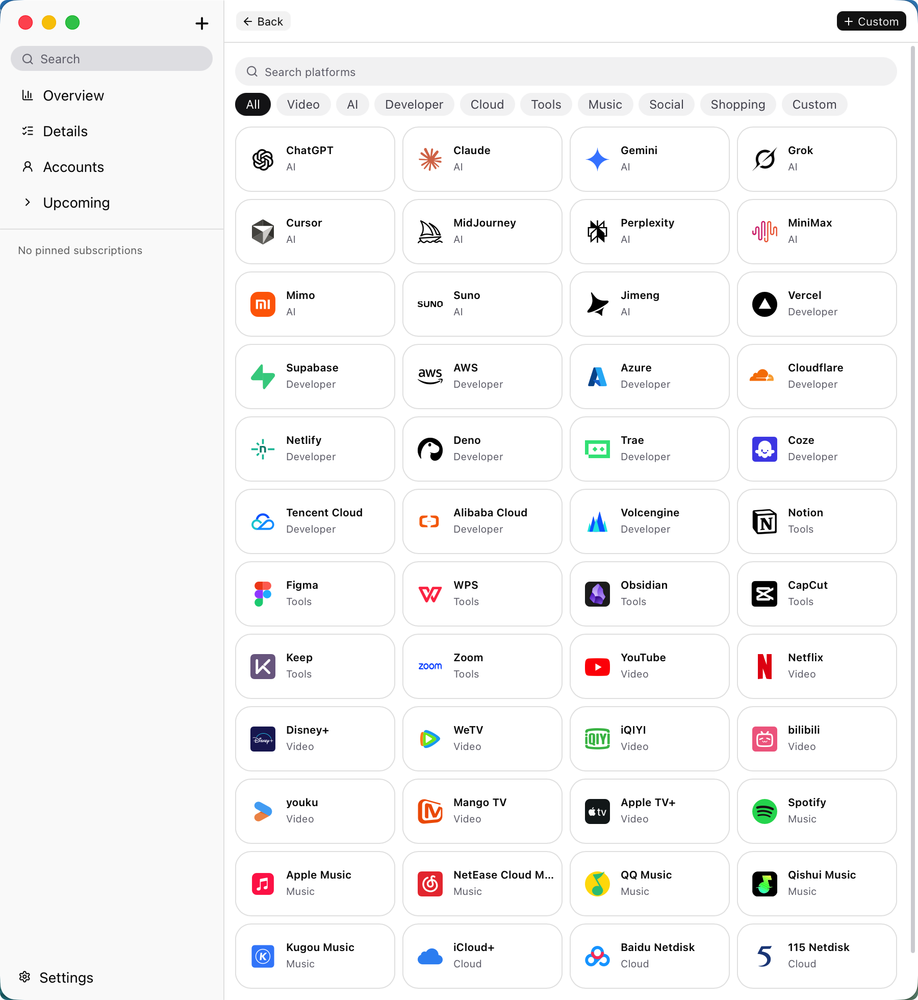
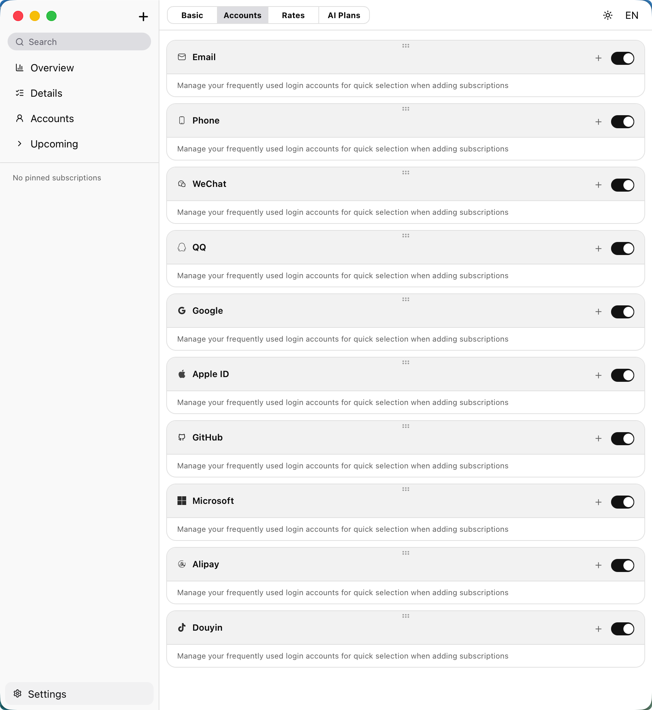
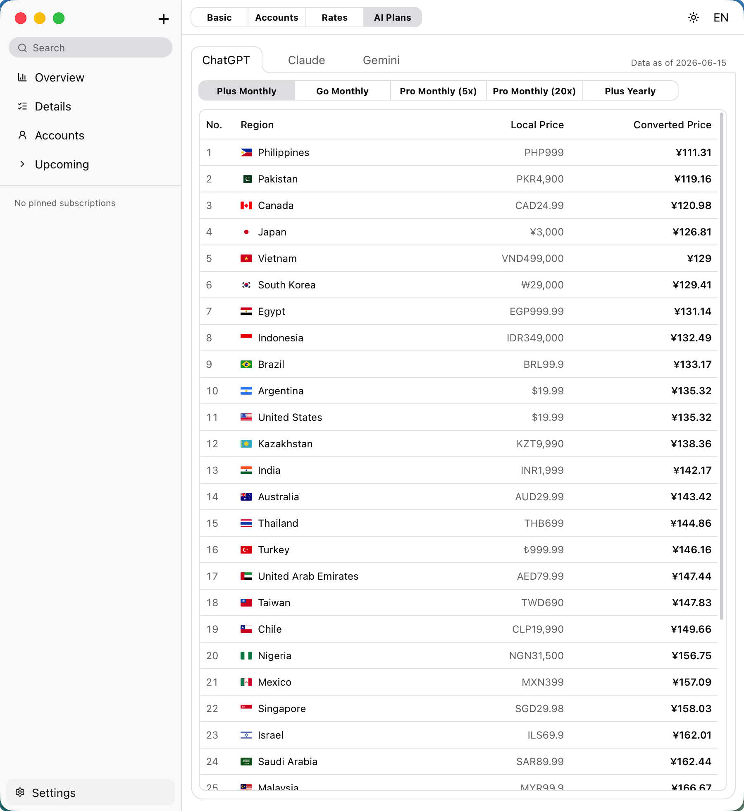

<div align="center">
  
  <h1>JioJio</h1>
  <p><strong>A local-first subscription &amp; account manager for macOS.</strong></p>
</div>

<p align="center">
  
  
  
  
  
  
  
</p>

<p align="center">简体中文 | <a href="README_CN.md">README_CN.md</a></p>

---

<table align="center" cellspacing="8" cellpadding="0" border="0">
  <tr>
    <td></td>
    <td></td>
  </tr>
  <tr>
    <td></td>
    <td></td>
  </tr>
</table>

---

## Why JioJio?

Most subscription trackers stop at "what am I paying for." JioJio goes one step further:

- **You have more subscriptions than you think.** Streaming, music, AI tools, cloud storage, developer services, productivity apps — they pile up fast, each with its own billing cycle, currency, and renewal date.
- **You forget which account you used.** Phone number on one, email on another, a third tied to a social login. Multiply that across several accounts on the same platform, and it's easy to lose track of who-pays-for-what and which login gets you in.
- **Your data stays on your device.** No cloud sync, no sign-up, no telemetry. Everything lives in local storage on your Mac.

## Core Idea

JioJio is built around two linked concepts:

1. **Subscriptions** — what you're paying for, how much, how often, and when it renews.
2. **Accounts** — the login identities (phone numbers, emails, social logins, etc.) behind those subscriptions.

By linking the two, JioJio answers the questions that spreadsheets can't: *"How many subscriptions are tied to this account?"* and *"Which account do I need to log into for this service?"* — even when you have multiple accounts on the same platform.

## Features

### Subscription Tracking
- **50+ built-in service templates** across 9 categories (Video, AI, Developer, Cloud, Tools, Music, Social, Shopping, and more) — with more being added regularly
- **Custom subscriptions** — add any service manually, not limited to built-in templates
- **Flexible billing cycles** — monthly, yearly, or custom intervals
- **Auto-renew tracking** and **expiry reminders** (same day, or 1/3/7 days before)
- **Pin important subscriptions** to keep them front and center


### Account & Login Management
- Record the **login method** for each subscription (phone, email, social/third-party login, etc.)
- Store **account identifiers** so you always know which login belongs to which service
- View accounts **by account** or **by platform**, and instantly see how many subscriptions each one covers
- Manage **multiple accounts on the same platform** without losing track


### AI Pricing Reference

JioJio includes a built-in **AI Plans** reference panel in Settings, covering ChatGPT, Claude, and Gemini:

- Browse every plan tier (Free, Plus, Pro, Team, etc.) in one place
- **Converted Price** column — all prices converted to your local currency at current exchange rates, so you can compare apples to apples
- **Ranked by price** — rows sorted from cheapest to most expensive, with a row index so you can see at a glance where each region stands
- Prices span **30+ countries and regions** with their local currency originals alongside the converted amount
- Data updated periodically to reflect the latest regional pricing


### Financial Overview
- **Dashboard** with monthly cost, annualized cost, and upcoming payments
- **Multi-currency support** with automatic conversion to your preferred base currency
- **Category breakdown** — see where your money actually goes
- **Cashflow timeline** — past 12 months actual spend + 3-month forecast

### Views & Filtering
- **Card view** and **table view**
- **Sort** by end date, start date, monthly price, or annual price
- **Filter** by billing cycle, payment method, category, auto-renew status, or reminder status
- **Search** across all subscriptions and accounts

### Personalization
- **Bilingual UI** — Chinese (中文) / English
- **Theme** — Follow system / Light / Dark
- **Custom exchange rates** — adjust currency conversion to match real-world rates

## Tech Stack

| Layer | Technology |
|-------|-----------|
| Framework | [Tauri 2](https://v2.tauri.app/) |
| Frontend | [React 19](https://react.dev/) + [TypeScript](https://www.typescriptlang.org/) |
| Styling | [Tailwind CSS v4](https://tailwindcss.com/) + [shadcn/ui](https://ui.shadcn.com/) |
| Icons | [Lucide React](https://lucide.dev/) + custom SVGs |
| Build | [Vite](https://vite.dev/) |
| Backend | [Rust](https://www.rust-lang.org/) |

## Platform Support

Each release ships two `.dmg` files for macOS:

- **`JioJio_x.y.z_苹果芯片.dmg`** — for Apple Silicon Macs (M1/M2/M3/M4 and newer). Smaller download, native performance.
- **`JioJio_x.y.z_Intel芯片.dmg`** — for Intel-based Macs.

### Installing the App

1. Open the `.dmg` and drag **JioJio** into your **Applications** folder.
2. The first time you launch it, macOS may say **"JioJio is damaged and can't be opened. You should move it to the Trash."**

   This does **not** mean the app is broken. JioJio is not yet signed/notarized with an Apple Developer certificate, so macOS quarantines it after download. To remove the quarantine flag and run it, open **Terminal** and run:

   ```bash
   sudo xattr -rd com.apple.quarantine /Applications/JioJio.app
   ```

   Then open JioJio normally. You only need to do this once per install.

   > Alternatively, go to **System Settings → Privacy & Security**, scroll down, and click **Open Anyway** after the first blocked launch.

## Getting Started

### Prerequisites

- [Node.js](https://nodejs.org/) (v18+)
- [Rust](https://www.rust-lang.org/tools/install) (latest stable)
- [Tauri Prerequisites](https://v2.tauri.app/start/prerequisites/)

### Install & Run

```bash
git clone https://github.com/AnsirStudio/JioJio.git
cd JioJio
npm install
npm run tauri dev
```

### Build

```bash
npm run tauri build
```

## Data Storage

All data is stored locally in the app's **localStorage**. Nothing is sent to any server. No account or registration required.

## Disclaimer

Third-party brand names, trademarks, and logos that may appear in this application are used solely to help users identify their own subscription services. All trademarks and logos are the property of their respective owners. This application is not affiliated with, sponsored by, authorized by, or in any official partnership with these brands, unless explicitly stated otherwise.

## License

[MIT License](https://opensource.org/licenses/MIT) — © AnsirStudio
