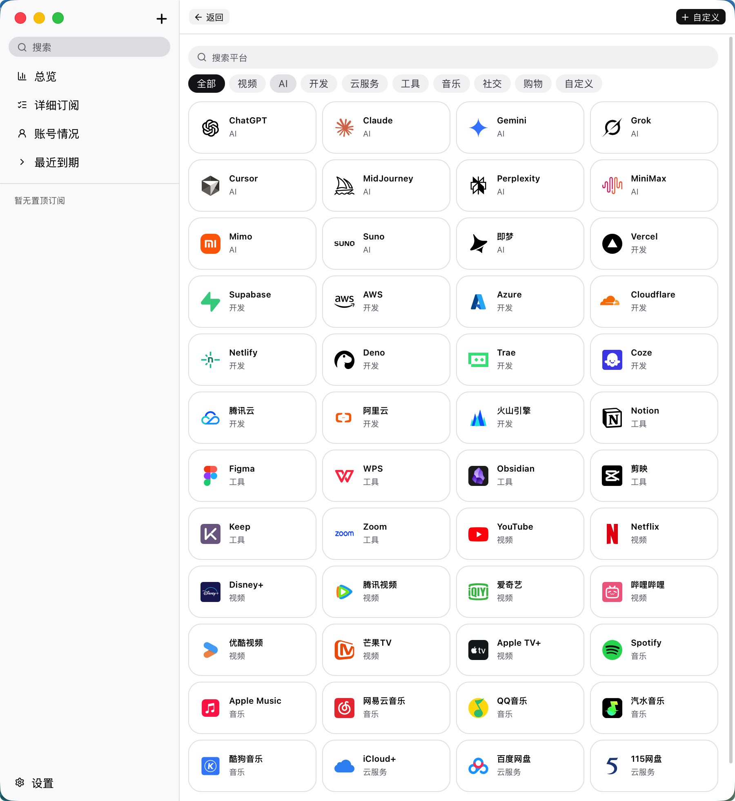
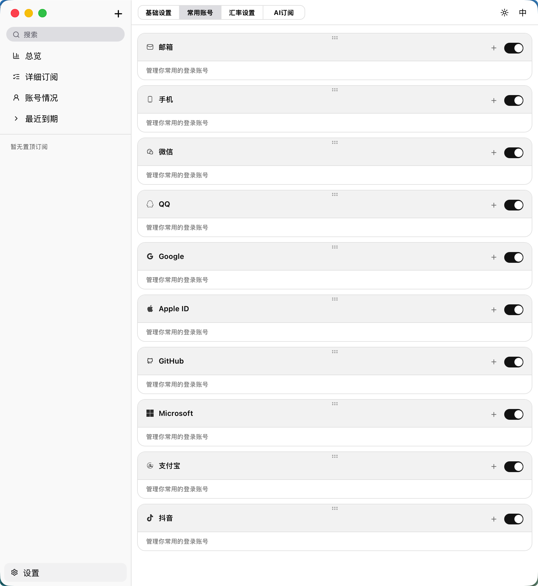
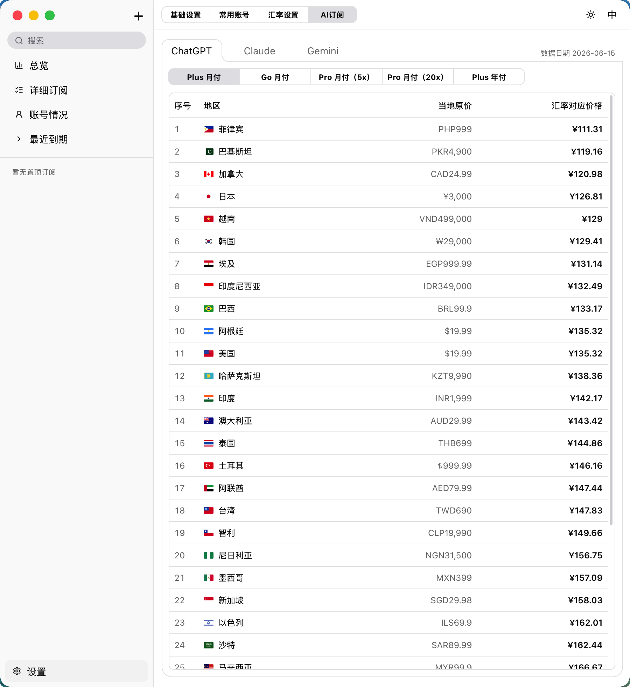

<div align="center">
  
  <h1>JioJio</h1>
  <p><strong>本地优先的订阅与账号管理工具。</strong></p>
</div>

<p align="center">
  
  
  
  
  
  
  
</p>

<p align="center"><a href="README.md">English</a> | 简体中文</p>

---

<table align="center" cellspacing="8" cellpadding="0" border="0">
  <tr>
    <td></td>
    <td></td>
  </tr>
  <tr>
    <td></td>
    <td></td>
  </tr>
</table>

---

JioJio 帮你记清楚每一个持续扣费的订阅 —— 更重要的是，**记清楚你当时用的是哪个账号注册的**。再也不用纠结"这个到底是用 Gmail 还是工作邮箱注册的"。

## 为什么是 JioJio？

大多数订阅记账工具只回答"我在为什么付钱"。JioJio 想再往前一步：

- **你的订阅比你想象中多。** 视频、音乐、AI 工具、云存储、开发者服务、效率工具……加起来很容易就是一长串，每个都有自己的计费周期、币种和到期日。
- **你记不清当时用的是哪个账号。** 这个用手机号，那个用邮箱，还有的用第三方登录。如果同一个平台还有好几个账号，谁绑定了什么订阅、登录哪个账号才能找到它，很快就会变成一团乱。
- **数据只留在你自己的设备上。** 不联网同步、不需要注册、不收集任何数据，所有内容都存在你 Mac 本地。

## 核心理念

JioJio 围绕两个互相关联的概念构建：

1. **订阅** —— 你在为什么付钱、多少钱、多久续一次、什么时候到期。
2. **账号** —— 这些订阅背后的登录身份（手机号、邮箱、第三方登录等）。

把这两者关联起来，JioJio 就能回答表格工具回答不了的问题：*"这个账号一共关联了多少个订阅？"* 以及 *"这个服务该用哪个账号登录？"* —— 即便同一个平台你有好几个账号，也不会再搞混。

## 功能特性

### 订阅管理
- **50+ 内置服务模板**，覆盖视频、AI、开发、云服务、工具、音乐、社交、购物等 9 大类别，并持续更新中
- **自定义订阅** —— 手动添加任意服务，不受内置模板限制
- **灵活计费周期** —— 按月、按年，或自定义周期
- **自动续费追踪** 与 **到期提醒**（当天，或提前 1/3/7 天）
- **置顶重要订阅**，一目了然


### 账号与登录管理
- 为每个订阅记录**登录方式**（手机号、邮箱、第三方/社交登录等）
- 存储**账号标识**，随时知道哪个登录对应哪个服务
- **按账号** 或 **按平台** 两种视角查看，一眼看出每个账号关联了多少订阅
- 轻松管理**同一平台下的多个账号**，不再混淆


### AI 订阅价格参考

设置页面内置 **AI 订阅** 价格参考面板，覆盖 ChatGPT、Claude、Gemini：

- 在一处浏览所有套餐档位（Free、Plus、Pro、Team 等）
- **汇率对应价格** —— 所有价格按当前汇率折算为你的本地货币，方便直接比较
- **按价格排序** —— 从低到高排列，序号一目了然，快速找到最划算的地区
- 覆盖 **30+ 个国家和地区**，附带原始本地货币价格
- 数据定期更新，反映最新区域定价


### 财务总览
- **仪表盘** —— 月度支出、年化成本、即将到期的款项
- **多币种支持**，自动按你设定的主币种折算
- **类别占比分析** —— 看清钱花在了哪些地方
- **现金流时间线** —— 过去 12 个月实际支出 + 未来 3 个月预测

### 视图与筛选
- **卡片视图** 与 **表格视图**
- **排序** —— 按结束日期、开始日期、月费、年费
- **筛选** —— 按计费周期、支付方式、类别、续费状态、提醒状态
- **搜索** —— 快速查找订阅与账号

### 个性化设置
- **双语界面** —— 中文 / English
- **主题切换** —— 跟随系统 / 浅色 / 深色
- **自定义汇率** —— 按实际汇率手动调整币种转换

## 技术栈

| 层级 | 技术 |
|------|------|
| 框架 | [Tauri 2](https://v2.tauri.app/) |
| 前端 | [React 19](https://react.dev/) + [TypeScript](https://www.typescriptlang.org/) |
| 样式 | [Tailwind CSS v4](https://tailwindcss.com/) + [shadcn/ui](https://ui.shadcn.com/) |
| 图标 | [Lucide React](https://lucide.dev/) + 自定义 SVG |
| 构建 | [Vite](https://vite.dev/) |
| 后端 | [Rust](https://www.rust-lang.org/) |

## 平台支持

每个发布版本都包含两个 macOS 安装包：

- **`JioJio_x.y.z_aarch64.dmg`** —— 适用于搭载 Apple 芯片（M 系列：M1/M2/M3/M4 及更新机型）的 Mac，体积更小，原生性能更佳。
- **`JioJio_x.y.z_universal.dmg`** —— 通用版本，同时支持 Apple 芯片和 Intel 芯片的 Mac。体积稍大；如果你使用 Intel Mac，请选择这个版本。

## 快速开始

### 环境要求

- [Node.js](https://nodejs.org/) (v18+)
- [Rust](https://www.rust-lang.org/tools/install)（最新稳定版）
- [Tauri 依赖](https://v2.tauri.app/start/prerequisites/)

### 安装与运行

```bash
git clone https://github.com/AnsirStudio/JioJio.git
cd JioJio
npm install
npm run tauri dev
```

### 构建打包

```bash
npm run tauri build
```

## 数据存储

所有数据存储在应用本地的 **localStorage** 中。不会向任何服务器发送数据，无需注册账号。

## 免责声明

本应用中可能出现的第三方品牌名称、商标和 Logo 仅用于帮助用户识别其自身的订阅服务。所有商标和 Logo 均归其各自所有者所有。本应用与这些品牌方不存在从属、赞助、授权或官方合作关系，除非另有明确说明。

## 许可证

[MIT License](https://opensource.org/licenses/MIT) — © AnsirStudio
